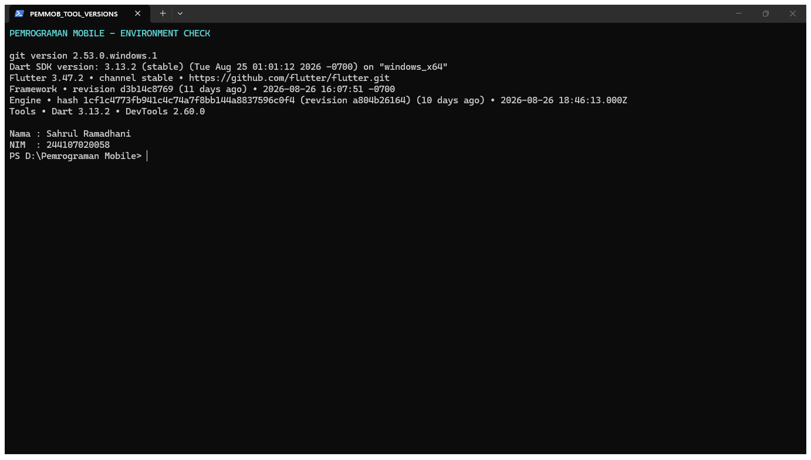
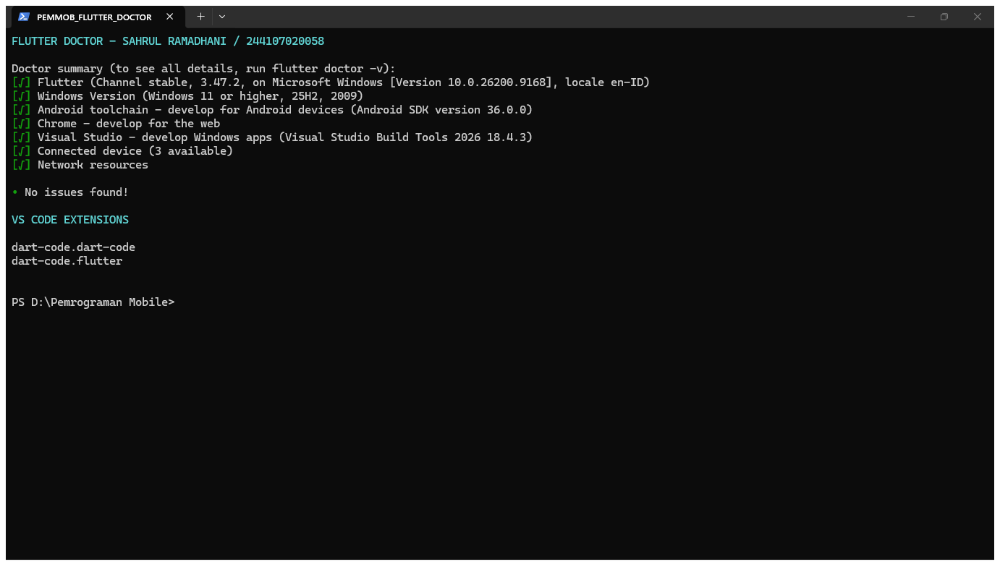
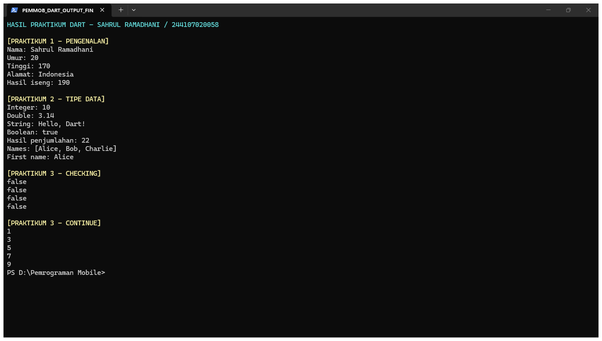
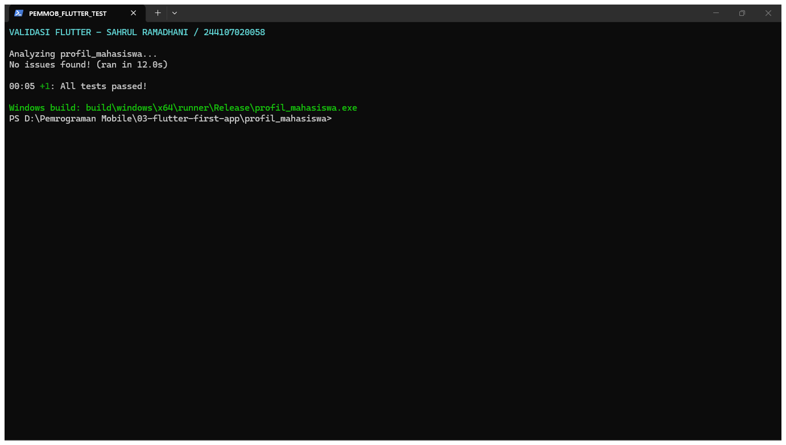

# Laporan Week 1

## Identitas

| Data | Keterangan |
| --- | --- |
| Nama | Sahrul Ramadhani |
| NIM | 244107020058 |
| Kelas | TI-3C |
| Mata Kuliah | Pemrograman Mobile |

## Tujuan

1. Menyiapkan lingkungan pengembangan Dart dan Flutter.
2. Memahami struktur project dan sintaks dasar Dart.
3. Mempraktikkan variabel, tipe data, konstanta, operator, input, dan null safety.
4. Mempraktikkan percabangan dan perulangan.
5. Membuat dan menjalankan aplikasi Flutter pertama.

## Sumber Materi

| Video | Materi |
| --- | --- |
| [Materi 1 Pengenalan Dart](https://www.youtube.com/watch?v=0B1xU-jpG7U) | Persiapan dan pengenalan Dart |
| [Materi 2 Pengenalan Dart](https://www.youtube.com/watch?v=616Hw3GVZO0) | Membuat dan menjalankan project Dart |
| [Materi 3 Pengenalan Dart](https://www.youtube.com/watch?v=gacbivZKuXk) | Sintaks dasar dan string interpolation |
| [Variable dan type data Dart](https://www.youtube.com/watch?v=sldl7be31Mg) | Variabel, tipe data, operator, dan null safety |
| [Perulangan Dart](https://www.youtube.com/watch?v=D3Ia9Aj1KZQ) | Percabangan, pengecekan, dan perulangan |

## Praktikum 1 - Pengenalan Dart

Project dibuat menggunakan `dart create`. Program mengenalkan fungsi `main`, variabel dengan `var`, string interpolation, konversi `String` menjadi `int`, dan perintah `dart run`.

Materi video pertama sampai ketiga dicatat melalui pemeriksaan instalasi, pembuatan project Dart, pengenalan struktur folder, serta latihan teks kampus dan bahasa pemrograman.

## Praktikum 2 - Variabel dan Tipe Data

Materi yang dipraktikkan mencakup `const`, `final`, `int`, `double`, `String`, `bool`, `List`, `Map`, `dynamic`, operator aritmetika, input terminal, serta nullable variable.

## Praktikum 3 - Percabangan dan Perulangan

Materi yang dipraktikkan mencakup `if/else`, ternary operator, `switch`, equality checking, `while`, `do-while`, `for`, `break`, dan `continue`.

Tugas akhirnya menerima lima nama dan nilai mahasiswa, menyimpannya dalam `Map`, kemudian menentukan kategori A, B, atau C.

## Flutter First App

Aplikasi Flutter menampilkan identitas mahasiswa menggunakan widget dasar. Project dijalankan setelah `flutter doctor` dan pemeriksaan device berhasil dilakukan.

## Bukti

Screenshot instalasi, hasil pemeriksaan, output praktikum, dan aplikasi berada dalam folder [screenshots](screenshots/README.md).

### Versi tools

### Flutter Doctor

### Device Flutter

### Output praktikum Dart

### Validasi project Flutter

### Aplikasi Flutter

### Android Studio dan Android Emulator

### Build APK Android

## Refleksi

### Kapan native lebih tepat dipilih daripada cross-platform?

Native lebih tepat ketika aplikasi memerlukan performa sangat tinggi, integrasi perangkat yang spesifik, atau akses paling awal ke API platform. Cross-platform lebih efisien ketika satu basis kode perlu digunakan untuk Android dan iOS.

### Bagaimana perubahan state berhubungan dengan widget tree dan UI deklaratif?

Widget tree mendeskripsikan tampilan berdasarkan state. Ketika state berubah, Flutter membangun ulang bagian widget tree yang terdampak sehingga tampilan selalu mencerminkan data terbaru.

### Mengapa commit kecil dengan pesan jelas bermanfaat?

Commit kecil mempermudah penelusuran perubahan, code review, pencarian sumber kesalahan, kolaborasi tim, dan pembacaan perkembangan project sebagai portofolio.
