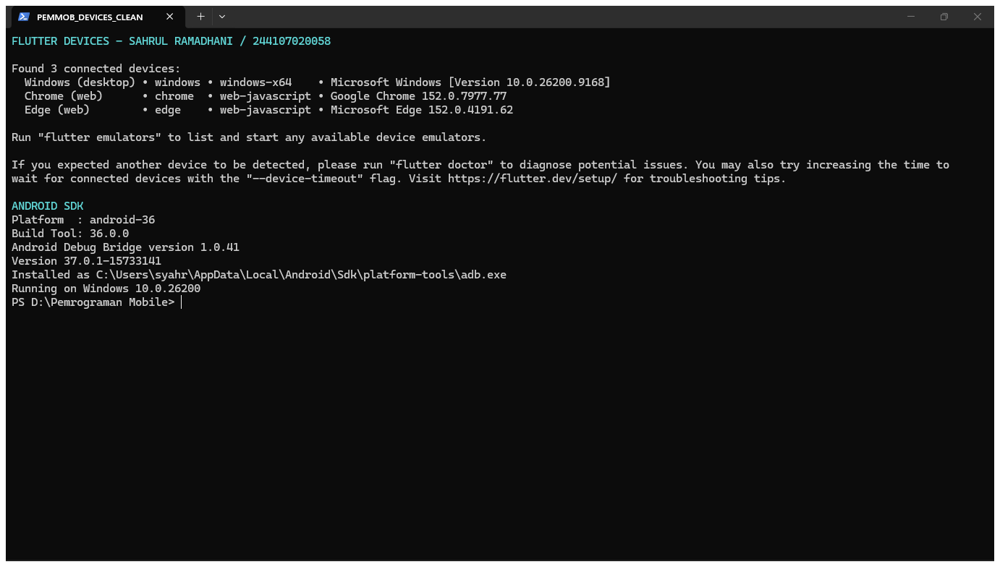
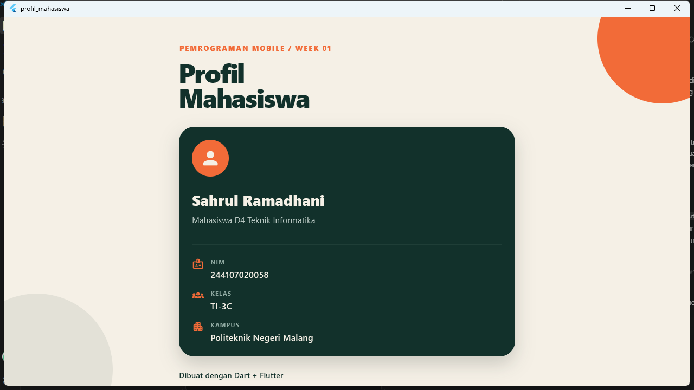
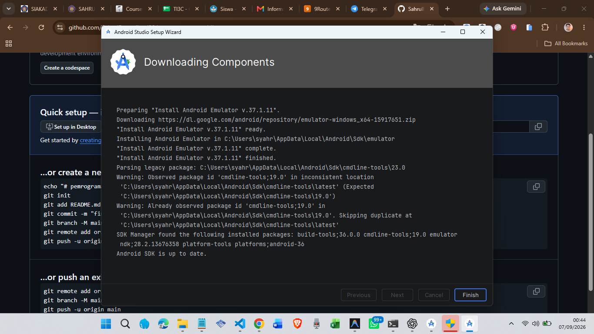
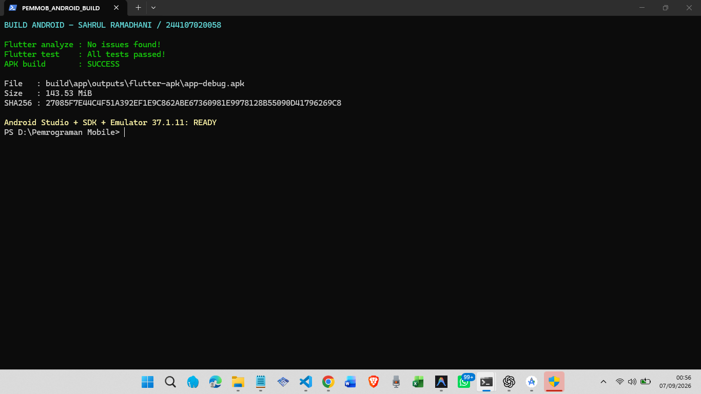

# Laporan minggu 1

## Identitas

| Data | Keterangan |
| --- | --- |
| Nama | Sahrul Ramadhani |
| NIM | 244107020058 |
| Kelas | TI-3C |
| Mata kuliah | Pemrograman Mobile |

## Tujuan

Minggu pertama membahas persiapan Dart dan Flutter, dasar bahasa Dart, percabangan, perulangan, dan pembuatan aplikasi Flutter sederhana.

## Sumber materi

1. [Pengenalan Dart 1](https://www.youtube.com/watch?v=0B1xU-jpG7U)
2. [Pengenalan Dart 2](https://www.youtube.com/watch?v=616Hw3GVZO0)
3. [Pengenalan Dart 3](https://www.youtube.com/watch?v=gacbivZKuXk)
4. [Variabel dan tipe data](https://www.youtube.com/watch?v=sldl7be31Mg)
5. [Perulangan Dart](https://www.youtube.com/watch?v=D3Ia9Aj1KZQ)

## Hasil praktikum

Praktikum 1 berisi pengenalan project Dart, fungsi main, variabel, teks, dan konversi data.

Praktikum 2 membahas tipe data, const, final, operator, input, List, Map, dynamic, dan null safety.

Praktikum 3 membahas if dan else, ternary, switch, pengecekan nilai, serta perulangan. Tugas akhirnya mengolah nama dan nilai lima mahasiswa, lalu menentukan kategori A, B, atau C.

Aplikasi Flutter pertama menampilkan nama, NIM, kelas, dan kampus.

## Bukti praktikum

### Versi aplikasi

### Flutter doctor

### Perangkat Flutter

### Hasil program Dart

### Pemeriksaan project Flutter

### Aplikasi profil

### Android Studio

### Build APK

## Kesimpulan

Dart, Flutter, Android Studio, dan Android SDK sudah terpasang. Semua latihan Dart berhasil dijalankan. Project Flutter juga berhasil diuji dan dibuat menjadi APK.
